<h2>TensorFlow-FlexUNet-Image-Segmentation-Pulmonary-Arteries-and-Veins (2026/03/06)</h2>
Sarah T.  Arai 
Software Laboratory antillia.com  
This is the first experiment of Image Segmentation for <b>Lung-Vessel-CT</b> based on our <a href="./src/TensorFlowFlexUNet.py">TensorFlowFlexUNet</a> 
(TensorFlow Flexible UNet Image Segmentation Model for Multiclass), 
and a 512x512 pixels
<a href="https://drive.google.com/file/d/17o_2MkVisYDyIHcqtPFX3CEiCE17-Pqa/view?usp=sharing">
<b>Lung-Vessel-CT-ImageMask-Dataset.zip</b></a> which was derived by us from   
<a href="https://www.kaggle.com/datasets/xiaoweixumedicalai/mytest/data">
<b>Pulmonary Arteries and Veins Segmentation in Lung</b> </a> on the kaggle.com.
  

<b>Actual Image Segmentation for Lung-Vessel-CT Images of  512x512 pixels </b> 
As shown below, the inferred masks predicted by our segmentation model trained by the dataset appear similar to the ground truth masks.
 
  
<table>
<tr>
<th>Input: image</th>
<th>Mask (ground_truth)</th>
<th>Prediction: inferred_mask</th>
</tr>
<tr>
<td>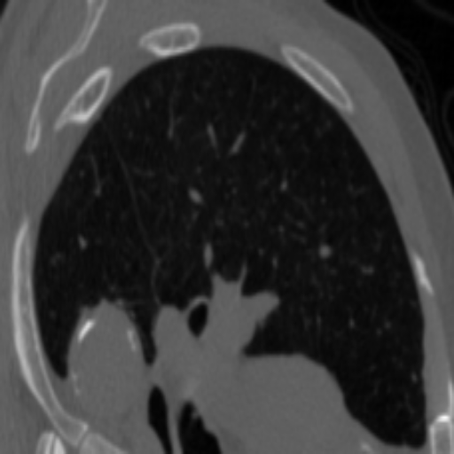</td>
<td>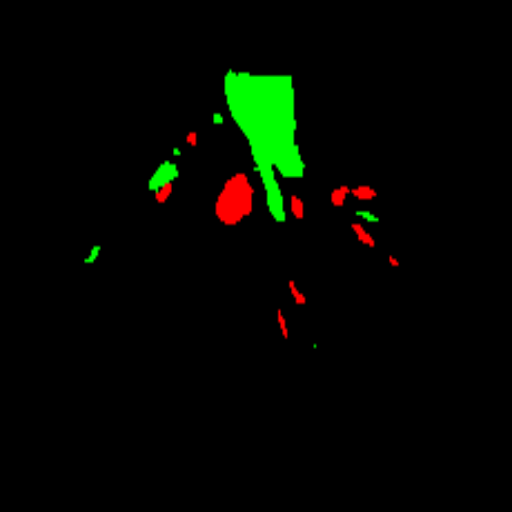</td>
<td>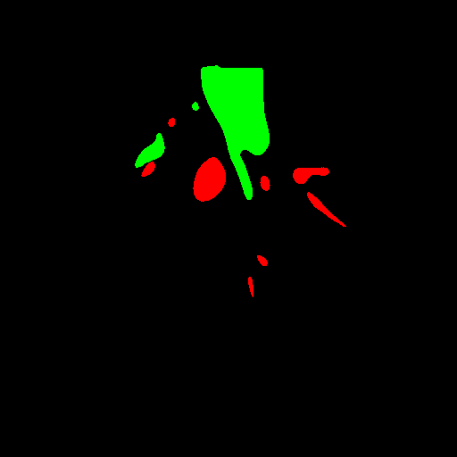</td>
</tr>
<tr>
<td>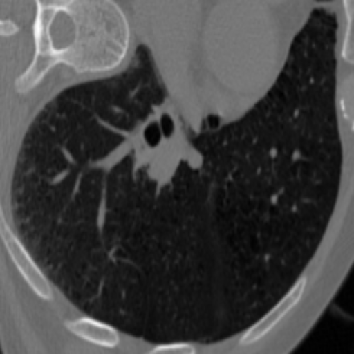</td>
<td>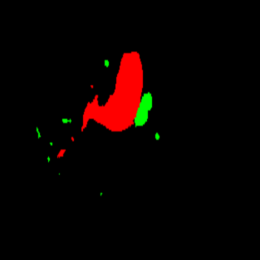</td>
<td></td>
</tr>
<tr>
<td>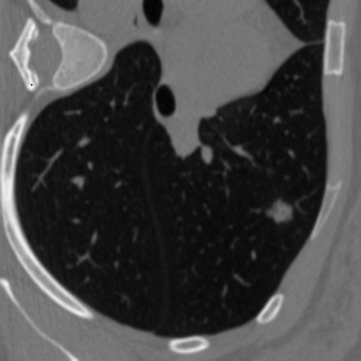</td>
<td>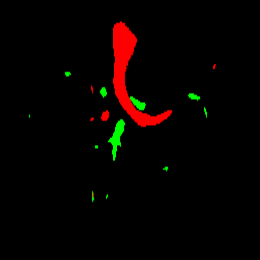</td>
<td>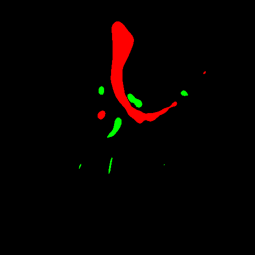</td>
</tr>
</table>

 
<h3>1  Dataset Citation</h3>
The dataset used here was derived from   
<a href="https://www.kaggle.com/datasets/xiaoweixumedicalai/mytest/data">
<b>Pulmonary Arteries and Veins Segmentation in Lung</b> </a>  
<b>3D CT Image Dataset for Pulmonary Arteries and Veins Segmentation in Lung</b> 
on the kaggle.com.
  
The following explanation was taken from the kaggle web site.
  
<b>About Dataset</b> 
Lung cancer is one of the leading causes of cancer-related morbidity and mortality worldwide, with an estimated 1.8 million deaths annually. 
Lung surgery especially segmentectomy has been the main treatment of lung cancer patients, in which precise cut of the affected lung part 
without affecting pulmonary arteries and veins is the key consideration. 
Otherwise, bleeding and increased surgical resection may happen during lung surgery if the anatomic structure of the patient is not well awared. 
Recently, 3D visualization 
including visual reality (VR) and 3D printing has been used for lung cancer surgery planning in which surgeons can obtain a vivid understanding of the anatomic structures. 
However, in current clinical practice, pulmonary arteries and veins are manually segmented, which is time-consuming, costly, and lacks reproducibility.
  
Our dataset comprises 95 3D CT scans obtained from Siemens’ SOMATOM Definition Flash machine. The patients’ age ranges from 29 to 82 years, with an average of 58.4 years. The images have a size of 512 × 512×(280−370) voxels, with a typical voxel size of 0.25×0.25×0.5mm3. The annotations encompass intrapulmonary and extrapulmonary arteries and veins. All the annotations are performed by lung cancer expert surgeons, investing 2-3.5 hours for each image. It’s important to note that all patients in the dataset underwent lung cancer surgery, and these annotations have been effectively employed in clinical practice to support surgeons in planning such surgeries. For the sake of labeling efficiency, only vessels in the left or right lung with nodes were labeled. Consequently, most images have annotations for only half of the lung, while a few have labels for both sections. In our experiments, we divided the dataset into two subsets, each representing half of the lung, and only the subset with annotations was utilized for training and testing.
 
This led to a final dataset consisting of 106 subjects. In addition, we also labeled the lung areas for two purposes. On one hand, this helps distinguish pulmonary arteries and veins inside and outside the lung.
  
The related conference paper titled with 'Fusion of Machine Learning and Deep Neural Networks for Pulmonary Arteries and Veins Segmentation 
in Lung Cancer Surgery Planning' can be found here [<a href="https://doi.org/10.1007/978-3-031-78198-8_28">https://doi.org/10.1007/978-3-031-78198-8_28</a>].

  
<b>License</b> 
<a href="https://www.apache.org/licenses/LICENSE-2.0">Apache 2.0</a>
 
 
<h3>
2 Lung-Vessel-CT ImageMask Dataset
</h3>
 If you would like to train this Lung-Vessel-CT Segmentation model by yourself,
please down load our dataset <a href="https://drive.google.com/file/d/17o_2MkVisYDyIHcqtPFX3CEiCE17-Pqa/view?usp=sharing">
<b>Lung-Vessel-CT-ImageMask-Dataset.zip</b>
</a> on the google drive, expand the downloaded, and put it under <b>./dataset/</b> to be.
<pre>
./dataset
└─Lung-Vessel-CT
    ├─test
    │   ├─images
    │   └─masks
    ├─train
    │   ├─images
    │   └─masks
    └─valid
        ├─images
        └─masks
</pre>

<b>Lung-Vessel-CT Statistics</b> 
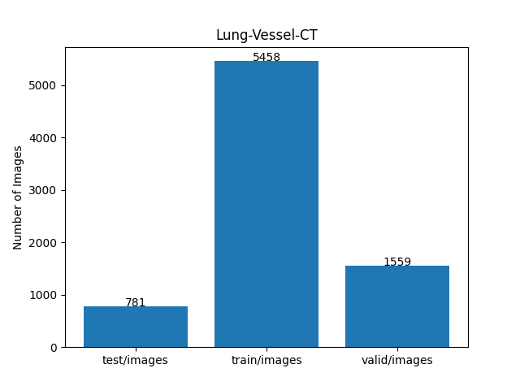 
 
As shown above, the number of images of train and valid datasets is not enough to use for a training set of our segmentation model.
  

<b>Train_images_sample</b> 
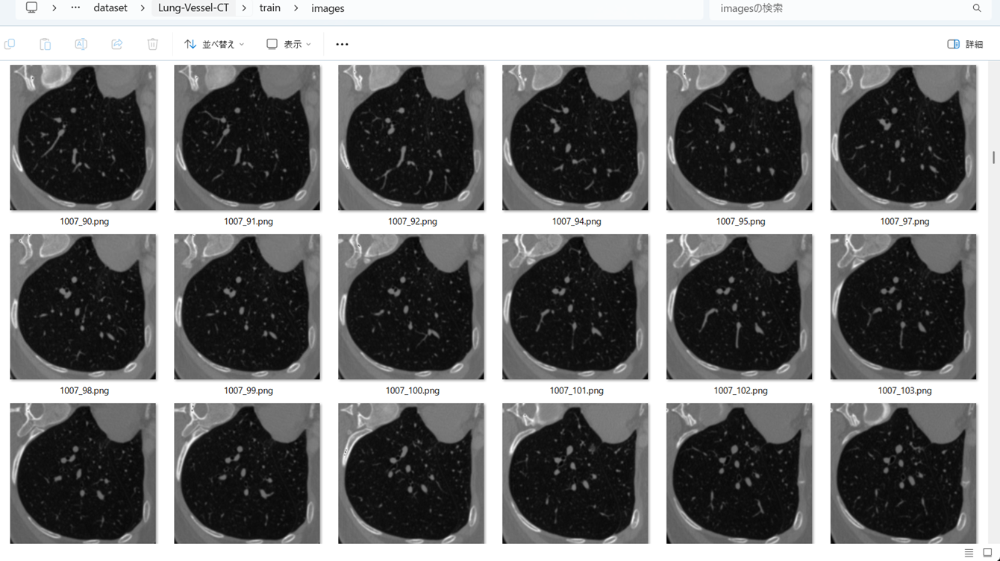
 
<b>Train_masks_sample</b> 
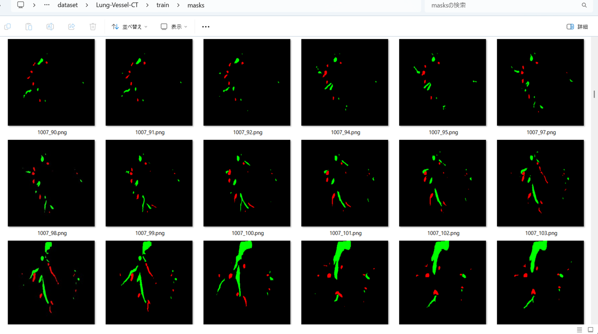
 
<h3>
3 Train TensorflowFlexUNet Model
</h3>
 We trained Lung-Vessel-CT TensorflowFlexUNet Model by using the following
<a href="./projects/TensorFlowFlexUNet/Lung-Vessel-CT/train_eval_infer.config"> <b>train_eval_infer.config</b></a> file.  
Please move to ./projects/TensorFlowFlexUNet/Lung-Vessel-CT, and run the following bat file. 
<pre>
>1.train.bat
</pre>
, which simply runs the following command. 
<pre>
>python ../../../src/TensorFlowFlexUNetTrainer.py ./train_eval_infer.config
</pre>

<b>Model parameters</b> 
Defined a small <b>base_filters=16</b> and a large <b>base_kernels=(11,11)</b> for the first Conv Layer of Encoder Block of 
<a href="./src/TensorFlowFlexUNet.py">TensorFlowFlexUNet.py</a> 
and a large num_layers (including a bridge between Encoder and Decoder Blocks).
<pre>
[model]
image_width    = 512
image_height   = 512
image_channels = 3
input_normalize = True
normalization  = False
num_classes    = 3
base_filters   = 16
base_kernels  = (11,11)
num_layers    = 8
dropout_rate   = 0.05
dilation       = (1,1)
</pre>
<b>Learning rate</b> 
Defined a small learning rate.  
<pre>
[model]
learning_rate  = 0.00007
</pre>
<b>Loss and metrics functions</b> 
Specified "categorical_crossentropy" and "dice_coef_multiclass". 
<pre>
[model]
loss           = "categorical_crossentropy"
metrics        = ["dice_coef_multiclass"]
</pre>
<b >Learning rate reducer callback</b> 
Enabled learing_rate_reducer callback, and a small reducer_patience.
<pre> 
[train]
learning_rate_reducer = True
reducer_factor     = 0.5
reducer_patience   = 4
</pre>
<b>Early stopping callback</b> 
Enabled early stopping callback with patience parameter.
<pre>
[train]
patience      = 10
</pre>
<b></b> 
<b>RGB color map</b> 
rgb color map dict for Lung-Vessel-CT 1+2 classes. 
<pre>
[mask]
mask_file_format = ".png"
;Lung-Vessel-CT 1+2
rgb_map = {(0,0,0):0, (255,0,0):1, (0,255,0):2 }
</pre>
<b>Epoch change inference callbacks</b> 
Enabled epoch_change_infer callback. 
<pre>
[train]
epoch_change_infer       = True
epoch_change_infer_dir   =  "./epoch_change_infer"
epoch_changeinfer        = False
epoch_changeinfer_dir    = "./epoch_changeinfer"
num_infer_images         = 6
</pre>
By using this epoch_change_infer callback, on every epoch_change, the inference procedure can be called
 for 6 images in <b>mini_test</b> folder. This will help you confirm how the predicted mask changes 
 at each epoch during your training process.    
<b>Epoch_change_inference output at starting (1,2,3)</b> 
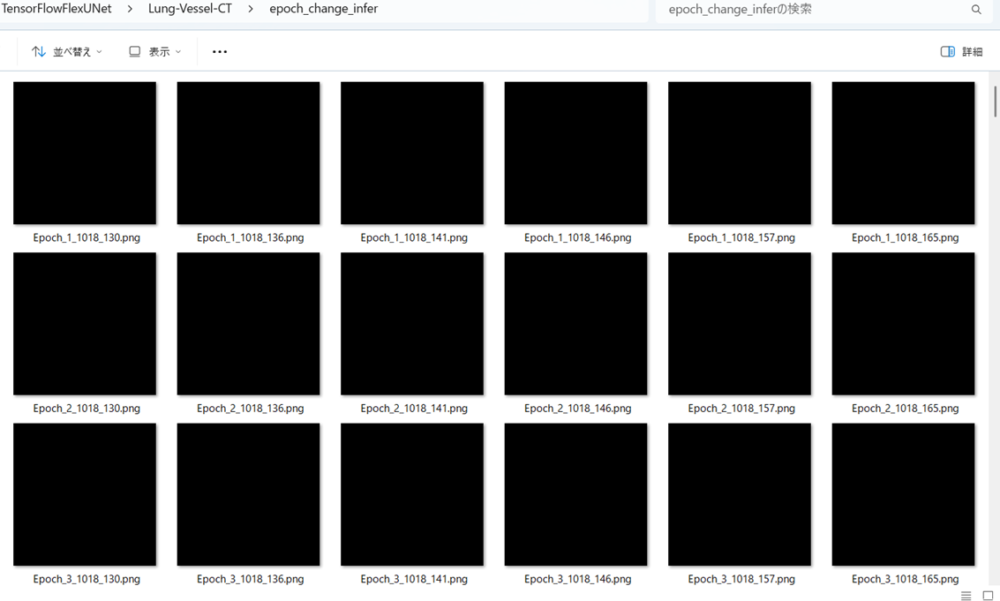 
 
<b>Epoch_change_inference output at middle-point (22,23,24)</b> 
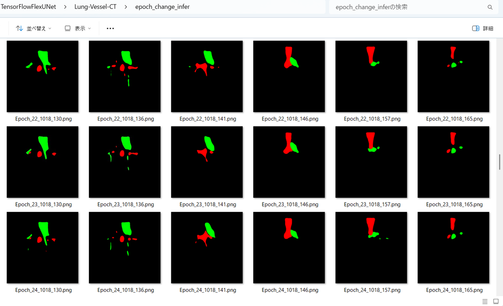 
 
<b>Epoch_change_inference output at ending (45,46,47)</b> 
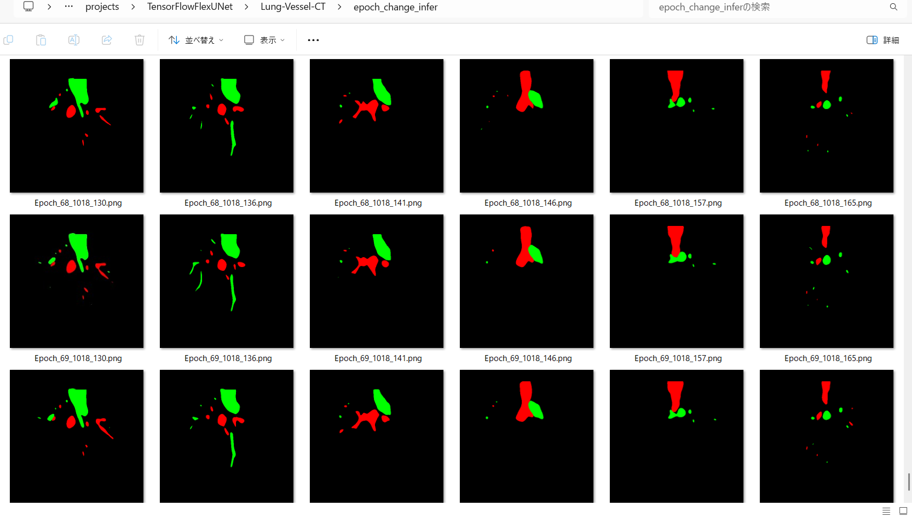 

 
In this experiment, the training process was terminated at epoch 47.  
<!--
 
-->
 
<a href="./projects/TensorFlowFlexUNet/Lung-Vessel-CT/eval/train_metrics.csv">train_metrics.csv</a> 
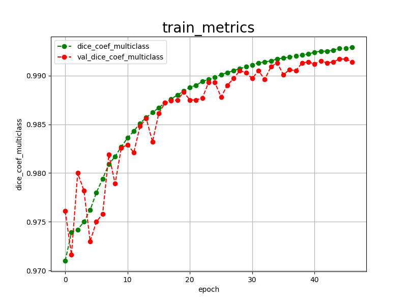 

 
<a href="./projects/TensorFlowFlexUNet/Lung-Vessel-CT/eval/train_losses.csv">train_losses.csv</a> 
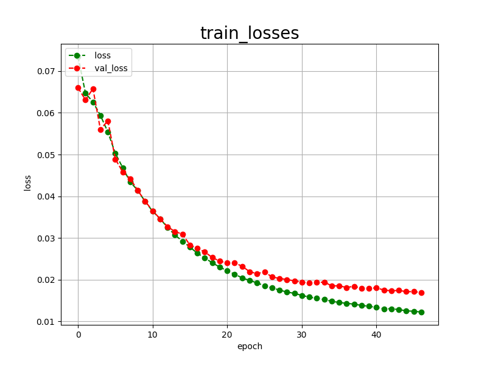 
 
<h3>
4 Evaluation
</h3>
Please move to a <b>./projects/TensorFlowFlexUNet/Lung-Vessel-CT</b> folder, and run the following bat file to evaluate TensorflowFlexUNet model for Lung-Vessel-CT. 
<pre>
>./2.evaluate.bat
</pre>
This bat file simply runs the following command.
<pre>
>python ../../../src/TensorFlowFlexUNetEvaluator.py  ./train_eval_infer.config
</pre>

Evaluation console output: 
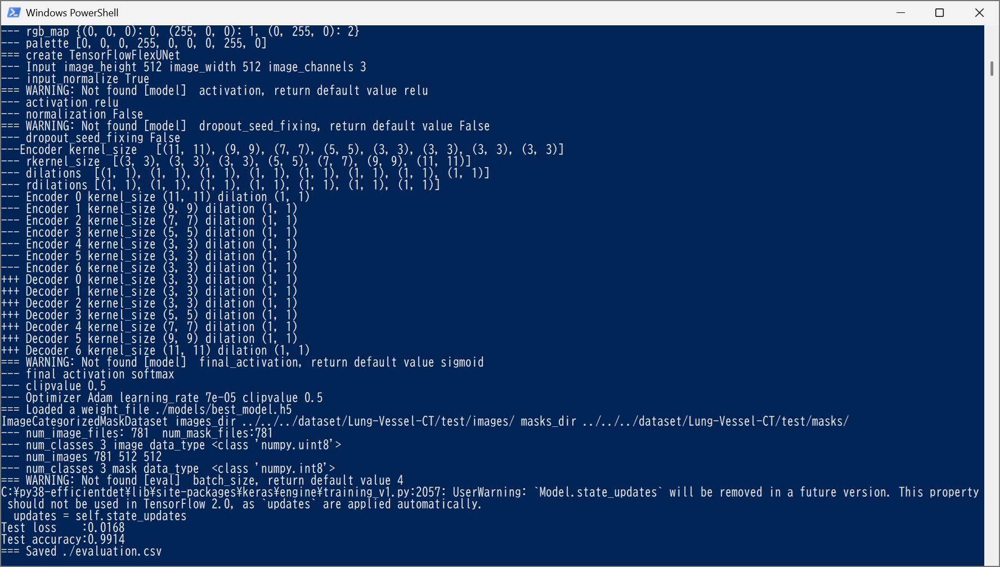
  Image-Segmentation-Lung-Vessel-CT

<a href="./projects/TensorFlowFlexUNet/Lung-Vessel-CT/evaluation.csv">evaluation.csv</a> 
The loss (categorical_crossentropy) to this Lung-Vessel-CT/test was low, and dice_coef_multiclass high as shown below.
 
<pre>
categorical_crossentropy,0.0168
dice_coef_multiclass,0.9914
</pre>
 
<h3>5 Inference</h3>
Please move to a <b>./projects/TensorFlowFlexUNet/Lung-Vessel-CT</b> folder, and run the following bat file to infer segmentation regions for images by the Trained-TensorflowFlexUNet model for Lung-Vessel-CT. 
<pre>
>./3.infer.bat
</pre>
This simply runs the following command.
<pre>
>python ../../../src/TensorFlowFlexUNetInferencer.py ./train_eval_infer.config
</pre>

<b>mini_test_images</b> 
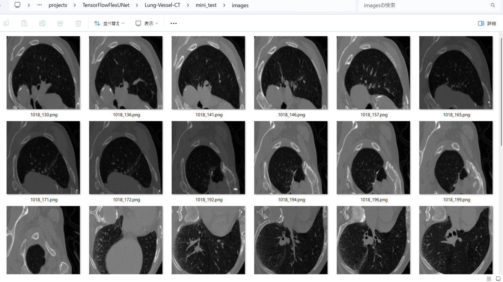 
<b>mini_test_mask(ground_truth)</b> 
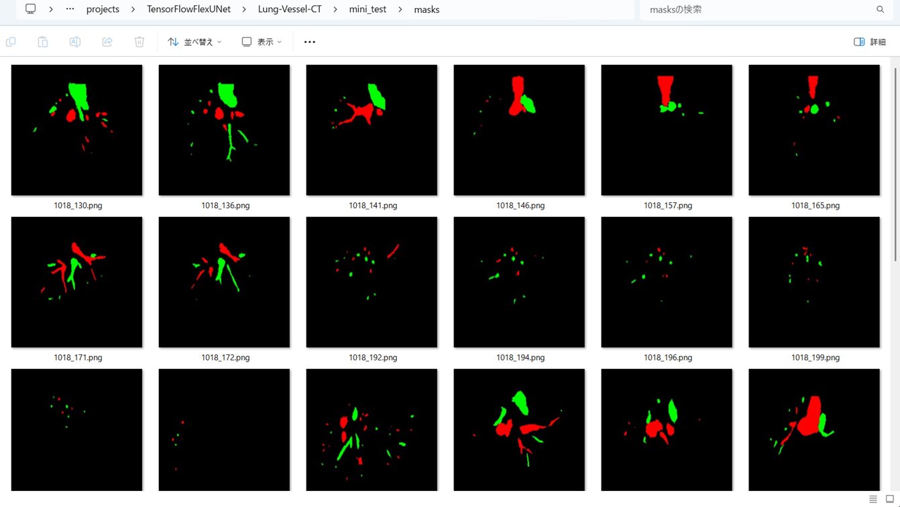 

<b>Inferred test masks</b> 
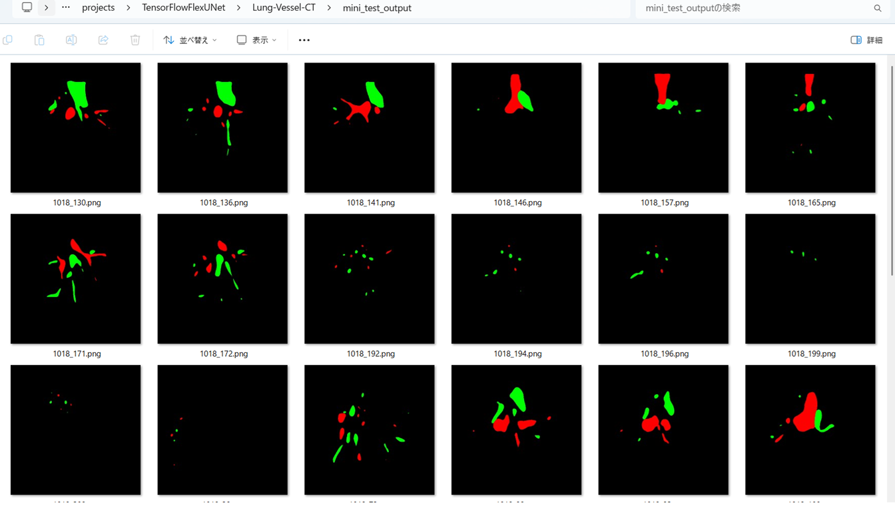 
 

<b>Enlarged images and masks for  Lung-Vessel-CT  Images of 512x512 pixels</b> 
As shown below, the inferred masks predicted by our segmentation model trained by the dataset appear similar to the ground truth masks.
 
 
<table>
<tr>
<th>Input: image</th>
<th>Mask (ground_truth)</th>
<th>Prediction: inferred_mask</th>
</tr>
<tr>
<td>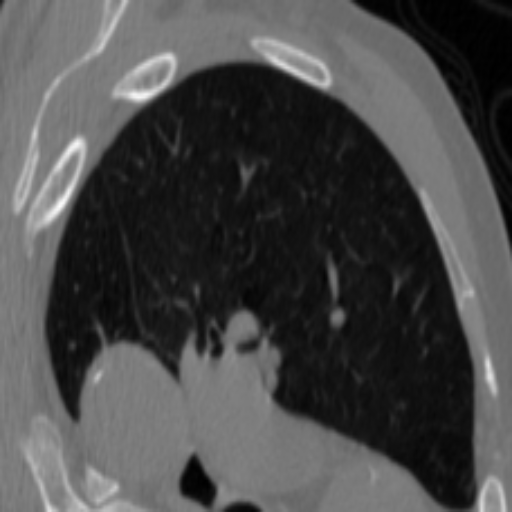</td>
<td>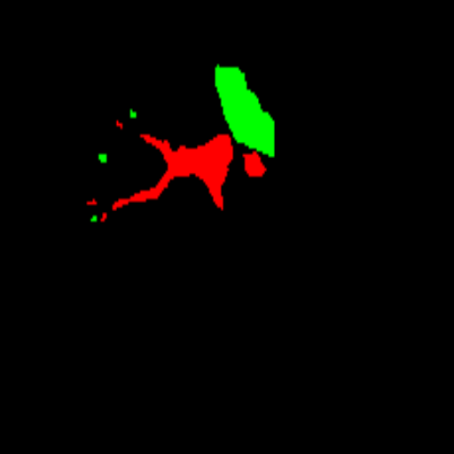</td>
<td>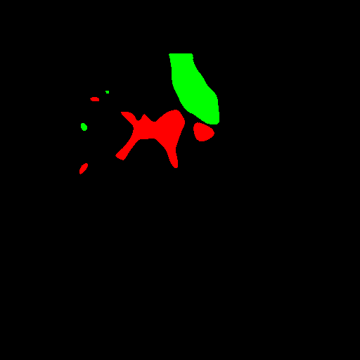</td>
</tr>

<tr>
<td>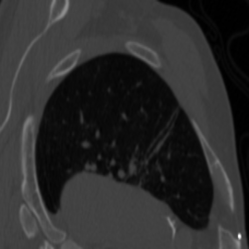</td>
<td>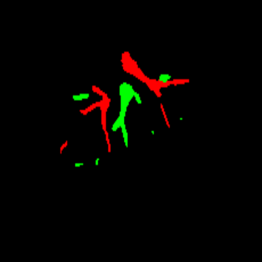</td>
<td>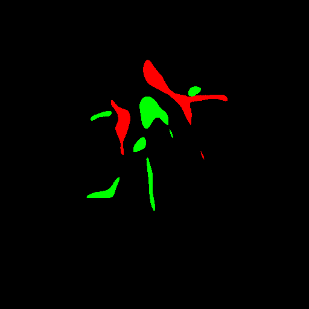</td>
</tr>

<tr>
<td>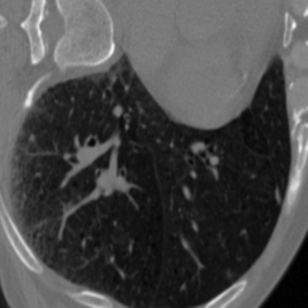</td>
<td>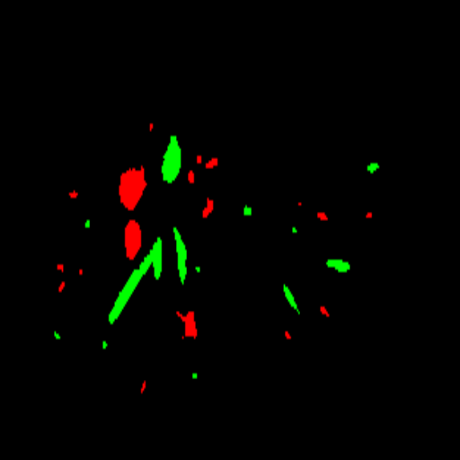</td>
<td>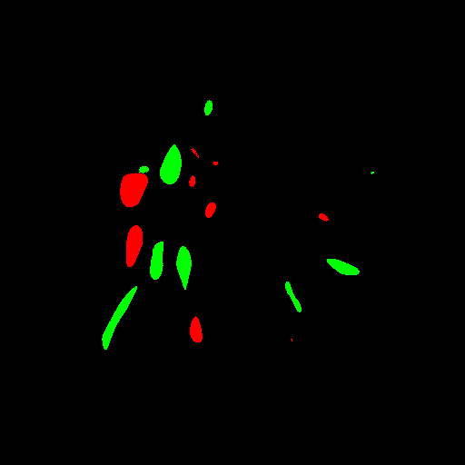</td>
</tr>
<tr>
<td>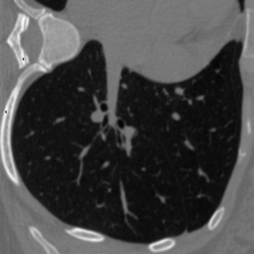</td>
<td>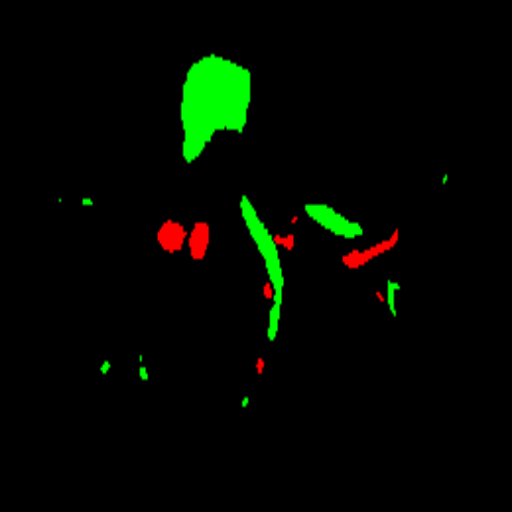</td>
<td>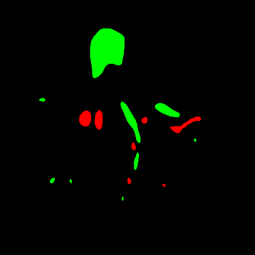</td>
</tr>
<tr>
<td>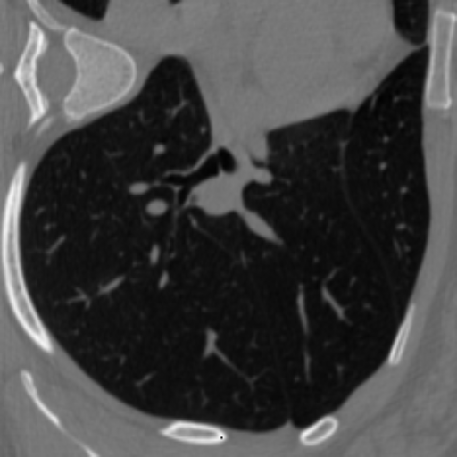</td>
<td>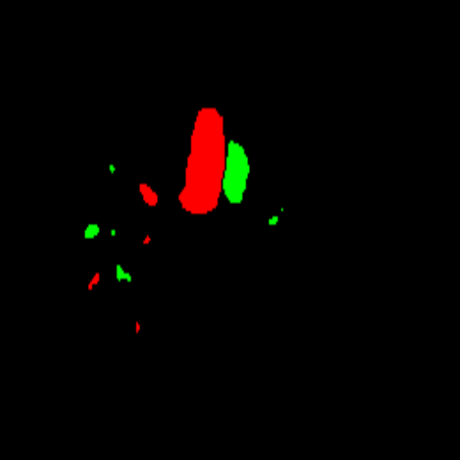</td>
<td>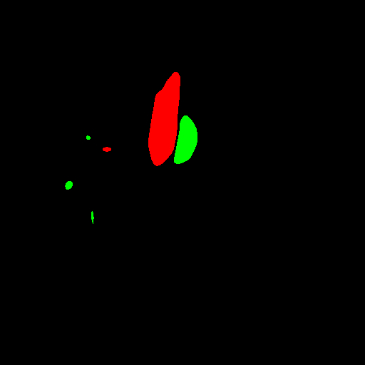</td>
</tr>
<tr>
<td>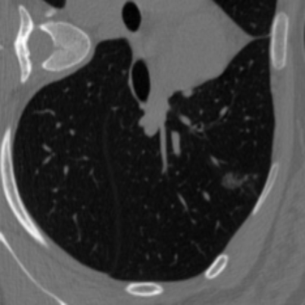</td>
<td>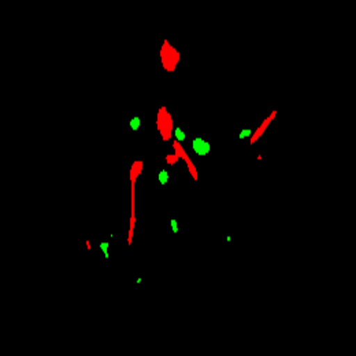</td>
<td>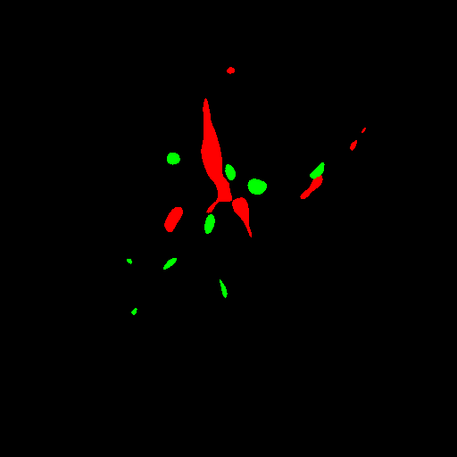</td>
</tr>
</table>

 
<h3>
References
</h3>
<b>1. Deep learning-driven pulmonary artery and vein segmentation reveals demography-associated vasculature anatomical differences</b> 
Yuetan Chu, Gongning Luo, Longxi Zhou, Shaodong Cao, Guolin Ma, Xianglin Meng, Juexiao Zhou, Changchun Yang, Dexuan Xie, Dan Mu, 
 Ricardo Henao, Gianluca Setti, Xigang Xiao, Lianming Wu, Zhaowen Qiu & Xin Gao 
<a href="https://www.nature.com/articles/s41467-025-56505-6">https://www.nature.com/articles/s41467-025-56505-6</a>
  
<b>2. Self-adaptive vision-language model for 3D segmentation of pulmonary artery and vein</b> 
Xiaotong Guo, Deqian Yang, Dan Wang, Haochen Zhao, Yuan Li, Zhilin Sui, Tao Zhou, Lijun Zhang, and Yanda Meng 
<a href="https://arxiv.org/pdf/2501.03722">https://arxiv.org/pdf/2501.03722</a>
  
<b>3. TensorFlow-FlexUNet-Image-Segmentation-Model</b> 
Toshiyuki Arai  
<a href="https://github.com/sarah-antillia/TensorFlow-FlexUNet-Image-Segmentation-Model">
https://github.com/sarah-antillia/TensorFlow-FlexUNet-Image-Segmentation-Model
</a>
 
 
